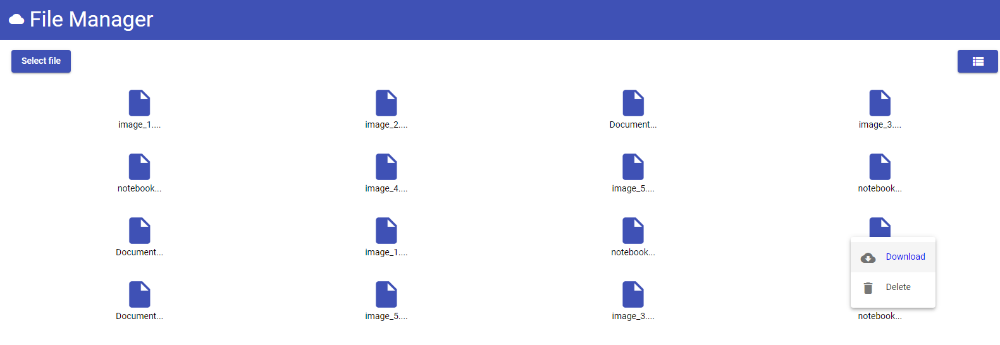
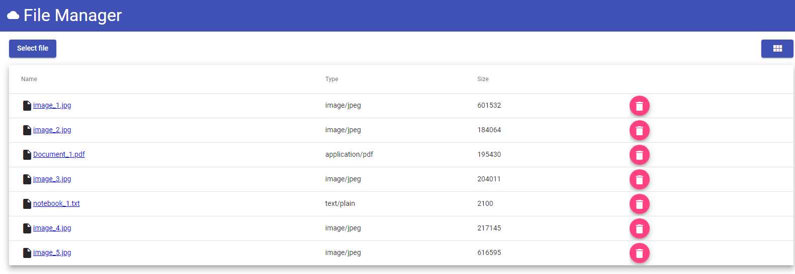

# Spring Boot 2 Angular 10 File Manager

This example app shows how to create a Spring Boot API and display its data with an Angular UI on the example file manager.

## Technologies
Backend:
* JAVA version 8
* Spring Boot 2
* Spring Data
* H2 database
* Maven
* Lombok

Frontend:
* Angular 10
* Angular Material

## Links
* [Backend](https://github.com/KrzysztofFyrla/Spring-Boot-2-Angular-10-File-Manager/tree/master/file-manager-backend)
* [Frontend](https://github.com/KrzysztofFyrla/Spring-Boot-2-Angular-10-File-Manager/tree/master/file-manager-frontend)

## Information
You will find more information: https://krzysztoffyrla.pl
